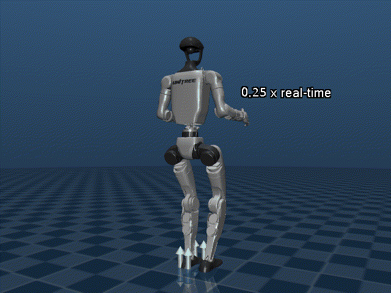

# SIPbasedCAMcontrol — Weighted Task-Priority Based Centroidal Angular Momentum Control for Cyclic Gait of a Humanoid Robot on Deformable Terrain (Paper Code)


This repository contains the code and experiments used in the following paper:

"Weighted Task-Priority Based Angular Momentum Control for Cyclic Gait of a Humanoid Robot on Deformable Terrain"

Authors: Sunil Gora, Shakti S. Gupta, Ashish Dutta 

Affiliation: Department of Mechanical Engineering, IIT Kanpur

## Overview

The code generates COM motion from a spherical inverted pendulum model and implements a weighted task-priority angular-momentum controller to generate cyclic humanoid gaits on deformable terrain. It includes:

- MuJoCo scene/model XMLs and generator utilities
- Environment and robot wrapper (`myRobotEnv.py`)
- Gait generation, SIP/LIPM planners (`myRobotGait.py`, `myRobotSIP.py`)
- Controller implementing the weighted task-priority angular-momentum method (`myRobotControl.py`)
- Plotting utilities for result visualization (`myRobotPlots.py`)
- Example launcher and experiment script (`runMe.py`)

## Key files

- `runMe.py` — Primary example launcher: builds models, generates gait, runs the controller and simulation loop, and produces plots and data files.
- `myRobotEnv.py` — Robot selection, MuJoCo XML scene generation / modification, and `myRobot` wrapper class that maps MuJoCo model/data → robot state and utilities.
- `myRobotGait.py` — Gait generation: SIP-to-humanoid mapping, LIPM/MPC planners, and trajectory splines.
- `myRobotControl.py` — `myController` class (inherits planner) that computes task-priority inverse kinematics and applies weighted angular-momentum control.
- `myRobotSIP.py` — SIP model implementation and trajectory generator (used by planners).
- `myRobotPlots.py` — Matplotlib plotting helpers used to render/compare desired vs actual trajectories, COM/COP, contact forces, torque, and energy metrics.

## Requirements

- Python 3.8+ (3.10/3.11 recommended)
- MuJoCo Python bindings (the code uses `mujoco` / `mujoco-python` APIs)
- Python packages: `numpy`, `scipy`, `matplotlib`, `moviepy` (for video), and optionally `pickle`/`scipy.io` for saving data

Install the common dependencies with pip (example):

```bash
python -m venv .venv
source .venv/bin/activate
pip install numpy scipy matplotlib moviepy mujoco
```

If you use a system-specific MuJoCo installation (binary + license), follow MuJoCo's install instructions for setting `LD_LIBRARY_PATH` and `MUJOCO_PY_MJKEY_PATH` (or equivalent) before running the code.

## Quick start

1) Create & activate a venv and install dependencies:

```bash
python -m venv .venv
source .venv/bin/activate
pip install numpy scipy matplotlib moviepy mujoco
```

2) Configure MuJoCo (if required by your setup). Ensure MuJoCo libraries and license are accessible from your environment.

3) Run the example launcher from the project root:

```bash
python runMe.py
```

By default `runMe.py` calls `selectRobot(num=2, vel=0.1, step_len=0.1, spno=1)` (Unitree G1). To run a different robot or change experiment parameters open and edit `runMe.py` near the top:

- `simend` and `simfreq` — simulation end time and controller frequency
- `selectRobot(num=1|2|3, vel, step_len, spno)` — choose robot and gait params
- Controller flags: `humn.KINctrl`, `humn.AMctrl`, `humn.ZMPctrl`, `humn.k_ub` — tune task-priority weights and control modes

To reproduce results from the paper, review the parameter blocks in `runMe.py`, `myRobotControl.py` and the XML model references used by `myRobotEnv.selectRobot()` and point them to the specific MuJoCo models used in your experiments.

## Outputs and saved data

When you run `runMe.py` the script will:

- generate planned joint trajectories and CAM trajectories and save `CAMTraj.dat`
- generate simulation data lists (`DesData`, `ActData`) and produce plots using `myRobotPlots.myDataplots`
- print RMS tracking errors (COM and other diagnostics)
- optionally save `.mat` files or video if enabled in the script

Check `runMe.py` and the end of the simulation block for the exact filenames and save options (e.g., `scipy.io.savemat` calls and `saveVid=True` passed to `humn.sim`).

## Running and customization

- To change the experiment, open `runMe.py` and edit the configuration block (simulation time, controller selection, model path).
- To use a different MuJoCo model, update the model XML path in the environment creation call.

## Citation

If you use this code, please cite:

Sunil Gora, Shakti S. Gupta, and Ashish Dutta, "Weighted Task-Priority Based Angular Momentum Control for Cyclic Gait of a Humanoid Robot on Deformable Terrain," ASME Journal of Mechanisms and Robotics.

```bibtex
@article{gora2026weighted,
  title = {Weighted Task-Priority Based Angular Momentum Control for Cyclic Gait of a Humanoid Robot on Deformable Terrain},
  author = {Gora, Sunil and Gupta, Shakti S. and Dutta, Ashish},
  journal = {ASME Journal of Mechanisms and Robotics},
}
```

---
